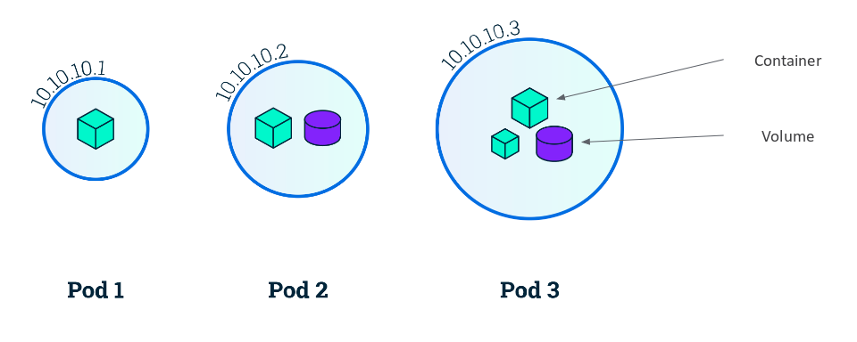

# Recursos de Kubernetes: pod

La unidad más pequeña de kubernetes son los **pod**, con los que podemos correr contenedores. Un **pod** representa un conjunto de contenedores que comparten almacenamiento y una única IP. **Los pod son efímeros**, cuando se destruyen se pierde toda la información que contenía. Si queremos desarrollar aplicaciones persistentes tenemos que utilizar volúmenes.

Por lo tanto, aunque Kubernetes es un orquestador de contenedores, la unidad mínima de ejecución son los pods. 

Si seguimos el principio de *un proceso por contenedor*, nos evitamos tener sistemas (como máquinas virtuales) ejecutando docenas de procesos, pero en determinadas circunstancias necesito más de un proceso para que se ejecute mi servicio. Por lo tanto parece razonable que podamos tener más de un contenedor compartiendo almacenamiento y direccionamiento, que llamamos *Pod*. Además existen mas razones:

* Kubernetes puede trabajar con distintos contenedores (Docker, Rocket, cri-o,...) por lo tanto es necesario añadir una capa de abstracción que maneje las distintas clase de contenedores.
* Además esta capa de abstracción añade información adicional necesaria en Kubernetes como por ejemplo, políticas de reinicio, comprobación de que la aplicación esté inicializada (readiness probe), comprobación de que la aplicación haya realizado alguna acción especificada (liveness probe), ...

## Ejemplos de implementación en pods

1. Un servidor web nginx con un servidor de aplicaciones PHP-FPM, lo podemos implementar en un pod, y cada servicio en un contenedor. 
2. Una aplicación Wordpress con una base de datos mariadb, lo implementamos en dos pods diferenciados, uno para cada servicio.

## Esqueleto YAML de un pod

Podemos describir la estructura de un pod en un fichero con formato Yaml, por ejemplo el fichero [`nginx.yaml`](ejemplos/nginx/nginx.yaml):

    apiVersion: v1
    kind: Pod
    metadata:
      name: nginx
      namespace: default
      labels:
        app: nginx
    spec:
      containers:
        - image:  nginx
          name:  nginx

Donde indicamos:

* `apiVersion: v1`: La versión de la API que vamos a usar.
* `kind: Pod`: La clase de recurso que estamos definiendo.
* `metadata`: Información que nos permite identificar unívocamente al recurso.
* `spec`: Definimos las características del recurso. En el caso de un pod indicamos los contenedores que van a formar el pod, en este caso sólo uno.

Para más información acerca de la estructura de la definición de los objetos de Kubernetes: [Understanding Kubernetes Objects](https://kubernetes.io/docs/concepts/overview/working-with-objects/kubernetes-objects/).

## Creación y gestión de un pod

Para crear el pod desde el fichero yaml anterior, ejecutamos:

    kubectl create -f nginx.yaml
    pod "nginx" created

Y podemos ver que el pod se ha creado:

    kubectl get pods
    NAME      READY     STATUS    RESTARTS   AGE
    nginx     1/1       Running   0          19s

Si queremos saber en que nodo del cluster se está ejecutando:

    kubectl get pod -o wide
    NAME      READY     STATUS    RESTARTS   AGE       IP                   NODE
    nginx     1/1       Running   0          1m       192.168.13.129    k8s-3

Para obtener información más detallada del pod:

    kubectl describe pod nginx
    Name:         nginx
    Namespace:    default
    Node:         k8s-3/10.0.0.3
    Start Time:   Sun, 13 May 2018 21:17:34 +0200
    Labels:       app=nginx
    Annotations:  <none>
    Status:       Running
    IP:           192.168.13.129
    Containers:
    ...

Para eliminar el pod:

    kubectl delete pod nginx
    pod "nginx" deleted

## Accediendo al pod con `kubectl`

Para obtener los logs del pod:

    $ kubectl logs nginx
    127.0.0.1 - - [13/May/2018:19:23:57 +0000] "GET / HTTP/1.1" 200 612     "-" "Mozilla/5.0 (X11; Linux x86_64; rv:60.0) Gecko/20100101    Firefox/60.0" "-"
    ...

Si quiero conectarme al contenedor:

    kubectl exec -it nginx /bin/bash
    root@nginx:/# 

Podemos acceder a la aplicación, redirigiendo un puerto de localhost al puerto de la aplicación:

    kubectl port-forward nginx 8080:80
    Forwarding from 127.0.0.1:8080 -> 80
    Forwarding from [::1]:8080 -> 80

Y accedemos al servidor web en la url `http://localhost:8080`.

