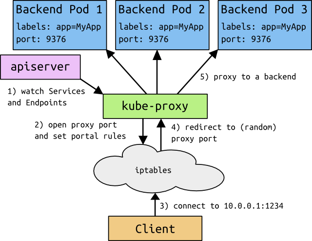
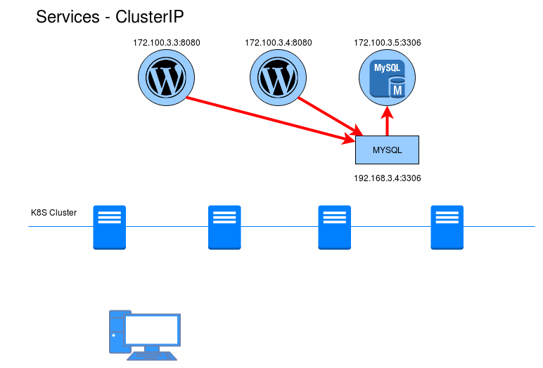
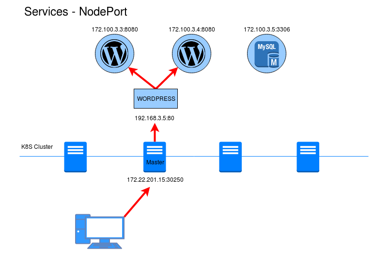
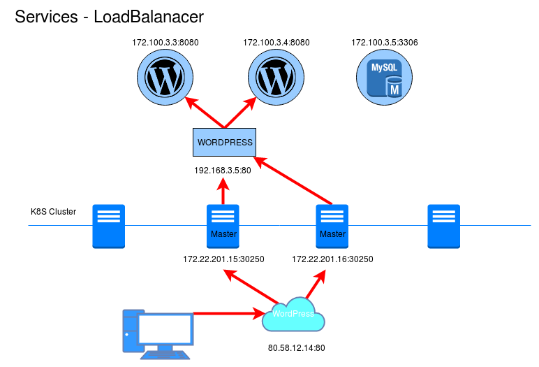

# Recursos de Kubernetes: Services

Los servicios ([`services`](https://kubernetes.io/docs/concepts/services-networking/service/)) nos permiten acceder a nuestra aplicaciones.

* Un servicio es una abstracción que define un conjunto de pods que implementan un micro-servicio. (Por ejemplo el *servicio frontend*).
* Ofrecen una dirección virtual (CLUSTER-IP) y un nombre que identifica al conjunto de pods que representa, al cual nos podemos conectar.
* La conexión al servicio se puede realizar desde otros pods o desde el exterior (mediante la generación aleatoria de un puerto).

Los servicios se implementan con *iptables*. El componente *kube-proxy* de Kubernetes se comunica con el servidor de API para comprobar si se han creado nuevos servicios. 

Cuando se crea un nuevo servicio, se le asigna una nueva ip interna virtual (IP-CLUSTER) que permite conexiones desde otros pods. Además podemos habiliar el acceso desde el exterior, se abre un puerto aleatorio que permite que accediendo a la IP del cluster y a ese puerto se acceda al conjunto de pods. Si tenemos más de un pod el acceso se hará siguiendo una política *round-robin*.

## Tipos de servicios

* **ClusterIP**: Solo permite el acceso interno entre distintos servicios. Es el tipo por defecto. Podemos acceder desde el exterior con la instrucción `kubectl proxy`, puede de ser gran ayuda para los desarrolladores.

* **NodePort**: Abre un puerto, para que el servicio sea accesible desde el exterior. Por defecto el puerto generado está en el rango de 30000:40000. Para acceder usamos la ip del servidor master del cluster y el puerto asignado.

* **LoadBalancer**: Este tipo sólo esta soportado en servicios de cloud público (GKE, AKS o AWS). El proveedor asignara un recurso de balanceo ed carga para el acceso a los servicios. si usamos un cloud privado, como OpenSatck necesitaremos un plugin para configurar el funcionamiento.

